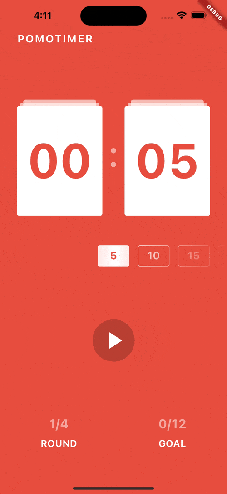
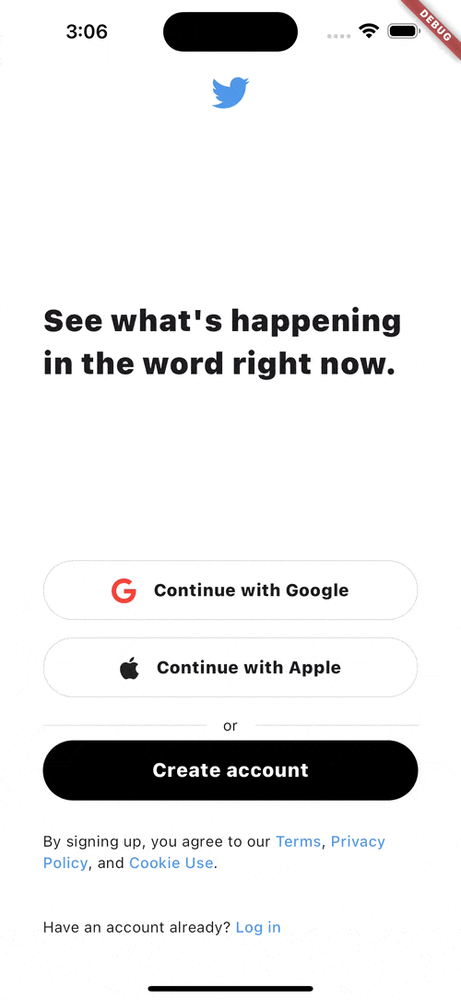
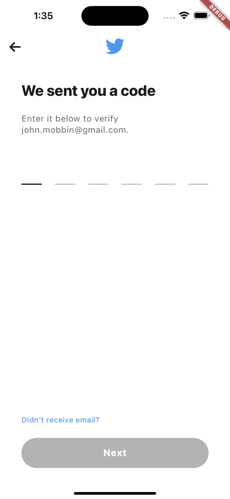
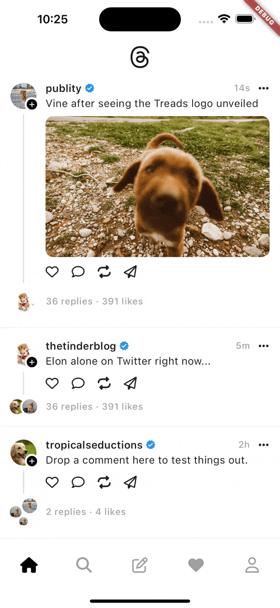
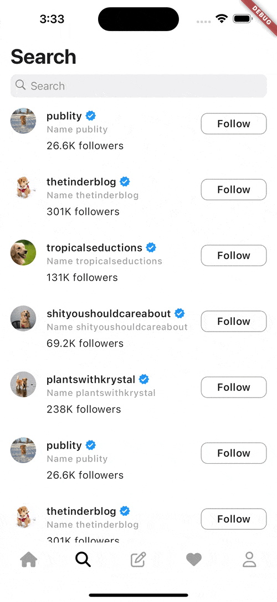
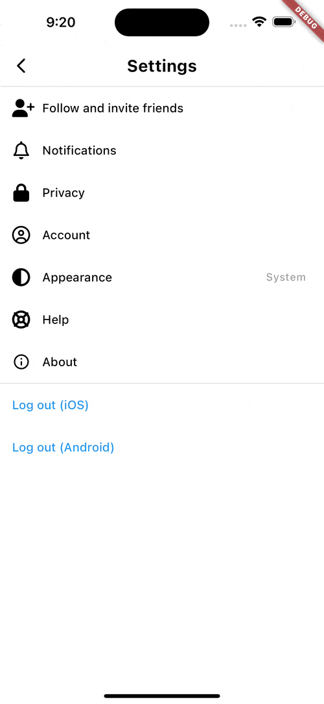
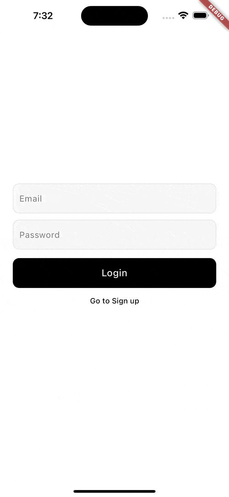
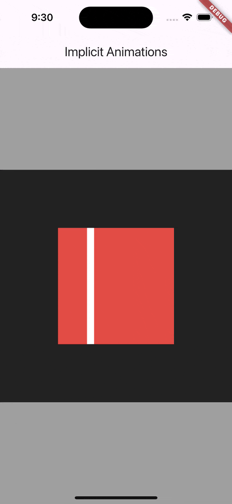
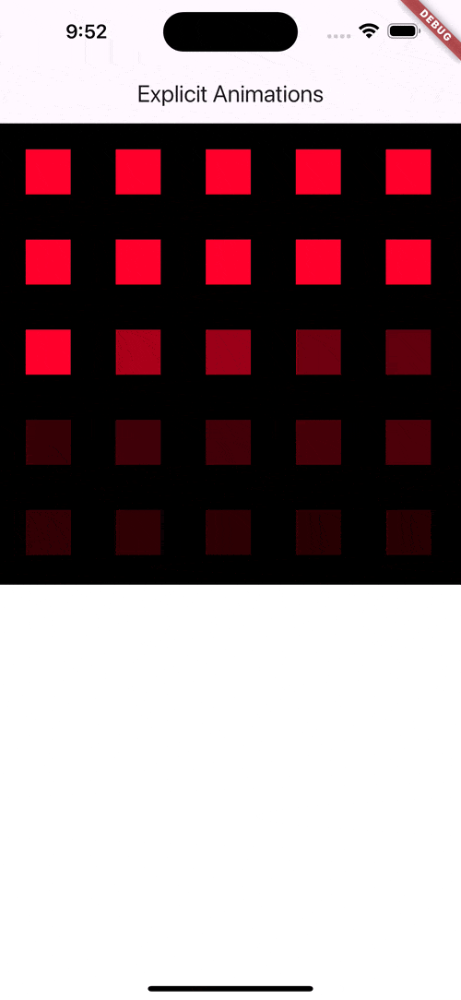
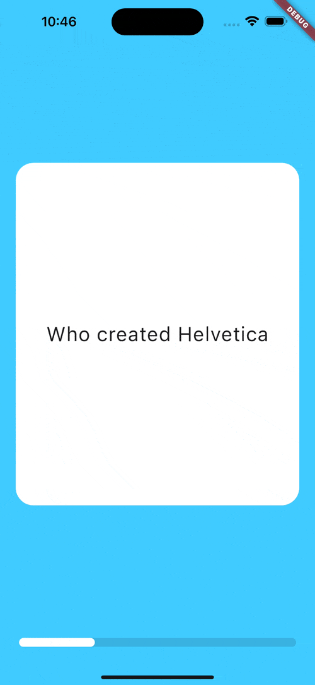

# Nomadcoders Flutter Challenge

- Nomadcoders에서 Flutter 스터디에 참여하여 진행했던 챌린지 모음
- 관련 강의
  - [Flutter로 웹툰 앱 만들기](https://nomadcoders.co/flutter-for-beginners)
  - [틱톡 클론코딩](https://nomadcoders.co/tiktok-clone)
  - [Flutter Animations 마스터클래스](https://nomadcoders.co/flutter-animations-masterclass)
- [개발 일지](./documents/log.md)

## Skills

- Dart
- Flutter
- Packages
  - [http](https://pub.dev/packages/http) : API 통신을 위한 package
  - [font_awesome_flutter](https://pub.dev/packages/font_awesome_flutter) : FontAwesome의 free icon을 사용하기 위한 package
  - [flutter_svg](https://pub.dev/packages/flutter_svg) : `.svg` image를 사용하기 위한 package
  - [intl](https://pub.dev/packages/intl) : Date formatting을 위한 package
  - [camera](https://pub.dev/packages/camera) : Camera 촬영을 위한 package
  - [permission_handler](https://pub.dev/packages/permission_handler) : 카메라, 마이크, 사진첩 등 권한 요청을 위한 package
  - [image_picker](https://pub.dev/packages/image_picker) : 사진첩에서 image를 가져오기 위한 package
  - [go_router](https://pub.dev/packages/go_router) : 선언적, 구조적 routing 코드 작성 및 web 환경 navigation 연습을 위한 package
  - [provider](https://pub.dev/packages/provider) : 설정 화면에서 appearance 변경 기능을 구현하기 위한 `ThemeMode` 상태 관리에 사용
  - [flutter_riverpod](https://pub.dev/packages/flutter_riverpod) : 상태 관리를 위한 package
  - [table_calendar](https://pub.dev/packages/table_calendar) : Moodtracker note를 날짜 별로 분류해서 보여주기 위한 package
  - [flutter_animate](https://pub.dev/packages/flutter_animate) : Flutter animation을 쉽게 사용하기 위한 app
  - [freezed](https://pub.dev/packages/freezed) : Model class에 JSON deserialization 및 identical equality를 구현하기 위해 사용
  - [just_audio](https://pub.dev/packages/just_audio) : iTunes API가 반환하는 sample audio url을 재생하기 위해 사용

## Results

### Flutter로 웹툰 앱 만들기

|         [Scheduler App](./lib/webtoon_app_challenge/scheduler_app/)         |         [Pomodoro App](./lib/webtoon_app_challenge/pomodoro_app/)          |
| :-------------------------------------------------------------------------: | :------------------------------------------------------------------------: |
|  |  |

|           [Movie App](./lib/webtoon_app_challenge/movie_app/)           |             [CGV Clone](./lib/webtoon_app_challenge/movie_cgv/)              |
| :---------------------------------------------------------------------: | :--------------------------------------------------------------------------: |
|  |  |

### 틱톡 클론코딩

|        [Twitter 1](./lib/tiktok_clone_challenge/twitter_onboarding/)        |        [Twitter 2](./lib/tiktok_clone_challenge/twitter_onboarding/)        |
| :-------------------------------------------------------------------------: | :-------------------------------------------------------------------------: |
|  |  |

|            [Thread 1](./lib/tiktok_clone_challenge/thread_app/)            |             [Thread 2](./lib/tiktok_clone_challenge/thread_app/)              |            [Thread 3](./lib/tiktok_clone_challenge/thread_app/)            |
| :------------------------------------------------------------------------: | :---------------------------------------------------------------------------: | :------------------------------------------------------------------------: |
|  |     |  |
|            [Thread 4](./lib/tiktok_clone_challenge/thread_app/)            |             [Thread 5](./lib/tiktok_clone_challenge/thread_app/)              |            [Thread 6](./lib/tiktok_clone_challenge/thread_app/)            |
|  |     |  |
|            [Thread 7](./lib/tiktok_clone_challenge/thread_app/)            |           [Moodtracker App](https://github.com/cskime/moodtracker)            |                                                                            |
|  |  |                                                                            |

### Flutter Animation 마스터클래스

| [Implicit Animation](./lib/flutter_animations_masterclass_challenge/implicit_animations/main.dart) | [Explicit Animation](./lib/flutter_animations_masterclass_challenge/explicit_animations/main.dart) | [CustomPaint](./lib/flutter_animations_masterclass_challenge/custom_paint_pomotimer/main.dart) |
| :------------------------------------------------------------------------------------------------: | :------------------------------------------------------------------------------------------------: | :--------------------------------------------------------------------------------------------: |
|                       |                       |         å         |
|          [Flipcard](./lib/flutter_animations_masterclass_challenge/flashcards/main.dart)           | [Apple Music Search](./lib/flutter_animations_masterclass_challenge/apple_music_search/main.dart)  |                                                                                                |
|                       |                |                                                                                                |
