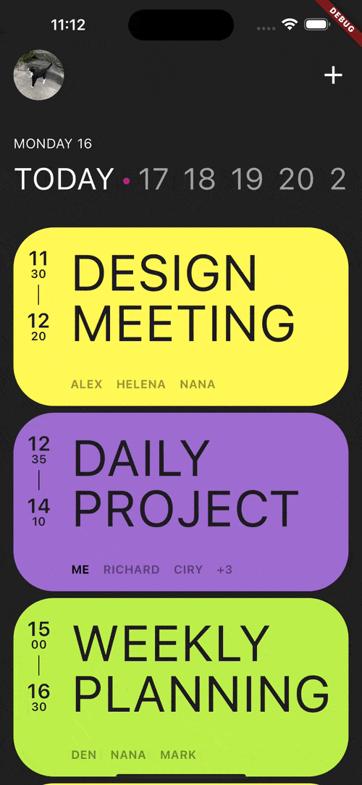
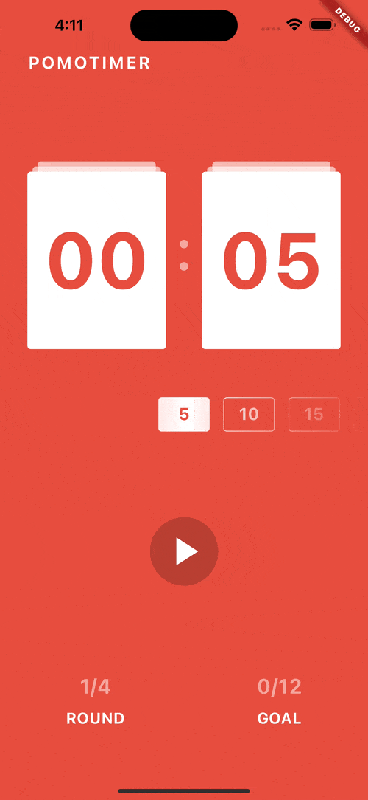

# Nomadcoders Flutter Challenge

- Nomadcoders에서 Flutter 스터디에 참여하여 진행했던 챌린지 모음
- 관련 강의
  - [Flutter로 웹툰 앱 만들기](https://nomadcoders.co/flutter-for-beginners)
  - [틱톡 클론코딩](https://nomadcoders.co/tiktok-clone)
  - [Flutter Animations 마스터클래스](https://nomadcoders.co/flutter-animations-masterclass)

## Skills

- Dart/Flutter
- Packages
  - http
  - font_awesome_flutter
  - flutter_svg

## Results

### Flutter로 웹툰 앱 만들기

|                            Scheduler App                             |                            Pomodoro App                             |
| :------------------------------------------------------------------: | :-----------------------------------------------------------------: |
|  |  |

|                            Movie App                             |                               CGV Clone                               |
| :--------------------------------------------------------------: | :-------------------------------------------------------------------: |
|  |  |

### 틱톡 클론코딩

### Flutter Animation 마스터클래스
