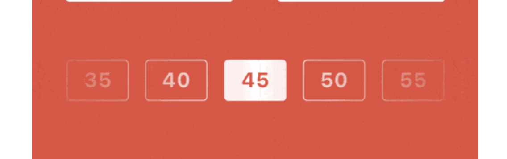
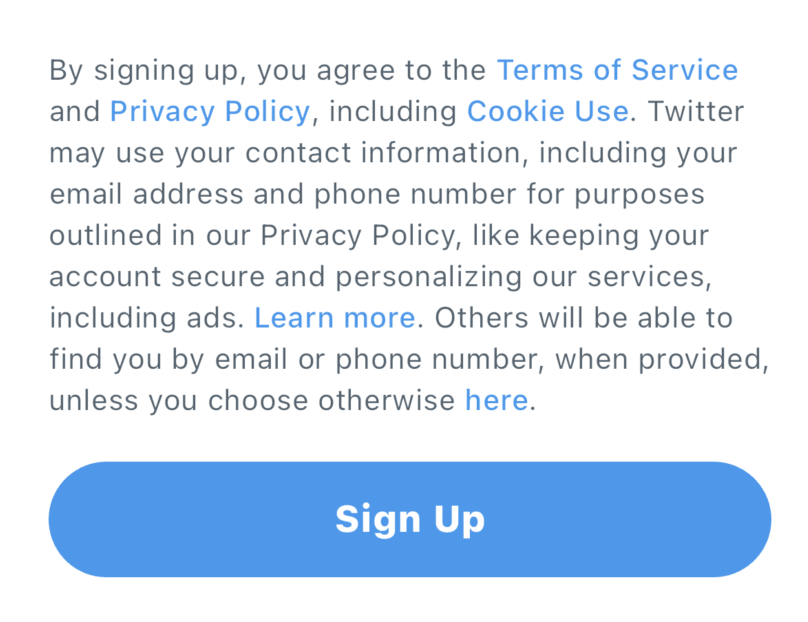
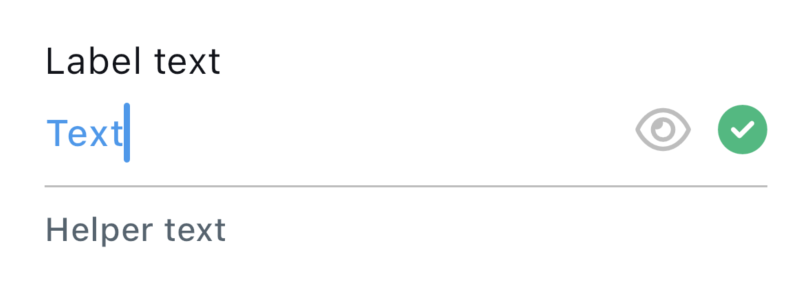
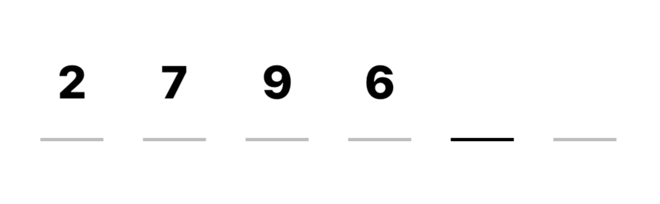
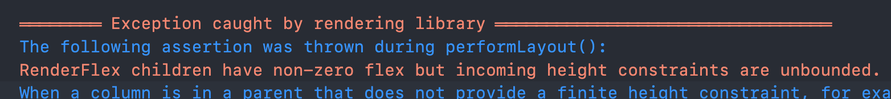
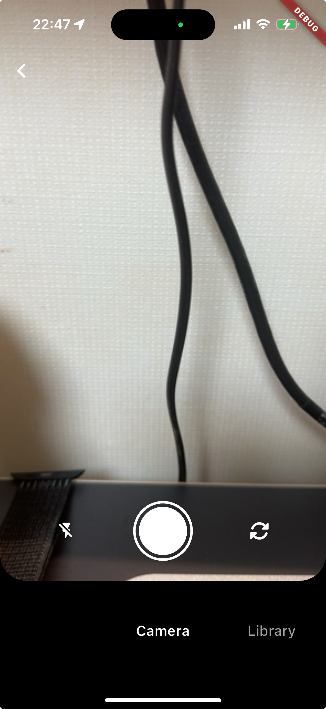

# 개발 일지

## Pomodoro App

### Fade Effect



**[구현 코드](../lib/webtoon_app_challenge/pomodoro_app/widgets/minute/minutes_list_fade_effect.dart)**

- 시간을 설정하는 버튼들 위에 `LinearGradient`를 덮어서 화면 가장자리로 갈수록 흐려지며 사라지는 효과 구현
- Gradient의 center color를 opacity가 0인 배경과 동일한 색상으로 설정해서 자연스러운 fade 효과 구현
- `IgnorePointer` widget을 사용해서 fade 효과를 주는 widget이 user event를 무시하고 아래 widget으로 전달하도록 구현

## Twitter Onboarding

### Text에서 특정 단어에 link 만들기



**[구현 코드](../lib/tiktok_clone_challenge/twitter_onboarding/features/common/widgets/linkable_text.dart)**

> 개념을 확장해서 text의 부분적 styling을 쉽게 할 수 있는 [`customizable_text` package](https://github.com/cskime/customizable_text)를 배포했습니다.

- Text에서 특정 단어에 다른 style을 줄 때 `RichText`를 사용함
- `RichText`는 전체 text의 길이와 다른 style을 갖는 단어의 개수가 많아질수록 `RichText`의 `children` 코드가 복잡해지고 변경하기 어려워지는 문제가 있음
- 전체 text와 그 중에서 다른 style을 적용할 text list만 전달해서 다른 style을 적용할 수 있는 `LinkableText` widget 구현
  - 특정 단어들에 다른 style 일괄 적용
  - 특정 단어에 개별적으로 style 적용
  - `TapGestureRecognizer`를 사용하여 링크를 실행시킬 수 있는 callback 제공
- 길고 복잡한 custom text를 쉽고 직관적으로 만들 수 있음
- 사용 예시
  - Before
    ```dart
    // 반복해서 사용되는 TextStyle을 변수로 선언
    final linkTextStyle = TextStyle(
      color: Palette.primary,
      fontWeight: FontWeight.w500,
    );
    Text.rich(
      TextSpan(
        text: 'By signing up, you agree to the ',
        children: [
          TextSpan(text: 'Terms of Service', style: linkTextStyle),
          TextSpan(text: ' and '),
          TextSpan(text: 'Privacy Policy', style: linkTextStyle),
          TextSpan(text: ', including '),
          TextSpan(text: 'Cookie Use', style: linkTextStyle),
          TextSpan(text: '. Twitter may use your contact information, including your email address and phone number for purposes outlined in our Privacy Policy, like keeping your account secure and personalizing our services, including ads. '),
          TextSpan(text: 'Learn more', style: linkTextStyle),
          TextSpan(text: '. Others will be able to find you by email or phone number, when provided, unless you choose otherwise '),
          TextSpan(text: 'here', style: linkTextStyle),
          TextSpan(text: '.'),
        ],
      ),
    ),
    ```
  - After
    ```dart
    LinkableText(
      text: 'By signing up, you agree to the Terms of Service and Privacy Policy, including Cookie Use. Twitter may use your contact information, including your email address and phone number for purposes outlined in our Privacy Policy, like keeping your account secure and personalizing our services, including ads. Learn more. Others will be able to find you by email or phone number, when provided, unless you choose otherwise here.',
      links: [
        Link(text: 'Terms of Service', callback: () {}),
        Link(text: 'Privacy Policy', callback: () {}),
        Link(text: 'Cookie Use', callback: () {}),
        Link(text: 'Learn more', callback: () {}),
        Link(text: 'here', callback: () {}),
      ],
    ),
    ```

### TextField Customizing



**[구현 코드](../lib/tiktok_clone_challenge/twitter_onboarding/features/common/widgets/custom_text_field.dart)**

- Flutter의 내장 `TextField`와 `TextFormField`는 UI customizingg에 한계가 있음
- 요구사항
  - Input text에 대한 verification이 통과되었을 때 오른쪽에 checkmark 표시되어야 함
  - 비밀번호 입력 text field의 경우 `obscureText` 설정을 toggle할 수 있는 버튼이 항상 표시되어야 함
- 위 요구사항을 구현할 때 `TextField.suffix` 및 `TextField.suffixIcon` 등을 사용할 수도 있지만, alignment나 padding 등을 커스터마이징 하는데 한계가 있음
  - 항상 표시되어야 하는 obscure toggle 버튼은 `suffixIcon`에, text가 입력되었을 때 표시되어야 하는 checkmark는 `suffix`에 할당할 수 있음
  - `suffix` -> `suffixIcon` 순서로 배치되기 때문에, obscure toggle 버튼을 checkbox 왼쪽에 배치할 수 없음
  - `suffixIcon`은 `TextField`의 전체 크기를 차지하며 오른쪽 끝에 고정되기 때문에, input text와 vertical align을 맞추기 어려움
- 이런 문제를 해결하기 위해 `TextField`를 활용한 `CustomTextField` widget 개발
  - Suffix icon들과 input text의 vertical center alignment 설정
  - 항상 표시되는 obscure toggle button이 text 입력 시에만 표시되는 checkmark icon보다 왼쪽에 위치
  - Label text 및 helper text가 나타나는 조건 설정 (behavior)
    - `CustomTextFieldLabelTextBehavior`
    - `CustomTextFieldHelperTextBehavior`

### VerificationCodeInput



**[구현 코드](../lib/tiktok_clone_challenge/twitter_onboarding/features/verification/widgets/verification_code_input.dart)**

- Code 숫자를 한 자리씩 나뉘어 입력할 수 있는 custom widget 개발
- `GestureDetector`로 tap event를 받으면 보이지 않게 숨겨둔 `TextField`에 연결해 둔 `FocusNode`로 focus를 요청하는 방식으로 숫자 키패드를 띄움
- 숨겨둔 `TextField`에 code를 입력할 때 마다 code text를 한 자리씩 parsing해서 6개의 digit text에 입력

## Thread Clone

### Post widget에서 content 양에 따라 늘어나는 vertical bar 구현


**[구현 코드](../lib/tiktok_clone_challenge/thread_app/features/home/widgets/post_list_item.dart)**

- Post widget에서 profile image와 content들은 각각 `Column`을 사용하고 있음
- Content 길이가 늘어남에 따라 profile image 아래 vertical bar가 남은 영역을 차지할 수 있도록 `Expanded` widget을 사용하려고 하면 "RenderFlex' exception 발생
  <div></div>
- `Column`은 height constraint가 unlimited이기 때문에 `Expanded`와 함께 사용하면 높이가 설정되지 않아서 exception error가 발생한다.
- 이 문제를 해결하기 위해 두 `Column`을 포함하고 있는 `Row`를 `IntrinsicHeight`으로 wrap
- `IntrinsicHeight`은 `Row` 아래에 있는 두 `Column`의 `children` widget들의 layout size를 계산해서 `Row`가 계산된 height을 사용하도록 함
- `IntrinsicHeight`에 의해 content height으로 높이가 고정되었으므로 `Expanded`를 사용해서 available space 전체에 vertical height을 그릴 수 있다.

### Modal bottom sheet를 사용할 때 content가 keyboard에 가리는 문제

**[구현 코드](../lib/tiktok_clone_challenge/thread_app/features/post/new-post/write_screen.dart)**

- `showModalBottomSheet`로 띄우는 widget은 keyboard가 나타나도 content 영역이 자동으로 줄어들지 않음
- Content가 keyboard에 가리지 않도록 content 영역의 크기를 조절해 주어야 함
- 다음과 같이 keyboard가 나타났을 때 content가 나타나는 영역의 크기를 계산하도록 구현
  - `MediaQuery.viewInsetsOf(context).bottom`
    - `MediaQuery.viewInsets`는 screen에서 system UI에 의해 가려지는 inset을 반환
    - 가상 keyboard가 screen을 가리고 있을 때, 이 값의 `bottom`은 keyboard 높이가 된다.
  - `LayoutBuilder`
    - Parent widget의 constraints를 사용해서 child widget을 build 할 수 있음
    - Bottom sheet의 전체 height에서 keyboard height을 제외한 영역에 content가 보여야 함
    - `BoxConstraints.maxHeight - keyboardHeight`으로 content height 계산

### `camera` package의 `CameraPreview` size 조절



**[구현 코드](../lib/tiktok_clone_challenge/thread_app/features/camera/camera_screen.dart)**

- `camera` package에서 camera 화면을 보여주기 위해 `CameraPreview` 사용
- `CameraPreview`는 내부적으로 `previewSize`를 이용해서 `AspectRatio` widget을 사용하여 preview size 비율이 고정됨
- `CameraPreview`를 화면 전체에 보여주려고 하는 경우, screen width가 max width constraint로 사용되므로 `CameraPreview` 크기를 비율에 맞게 키울 수 없다.
- `CameraPreview`가 기존의 size constraint를 벗어날 수 있도록 `OverflowBox`를 사용하고 `maxWidth`와 `maxHeight`을 변경하려는 size로 설정하면 전체 화면에 딱 맞게 크기를 키울 수 있다.
  - [참고한 코드](https://github.com/flutter/flutter/issues/15953#issuecomment-855182376)
  - Screen size와 `CameraPreview`의 내장 `previewSize`를 사용하여 `CameraPreview` height이 screen height일 때 늘어나야 하는 `CameraPreview` width를 계산
