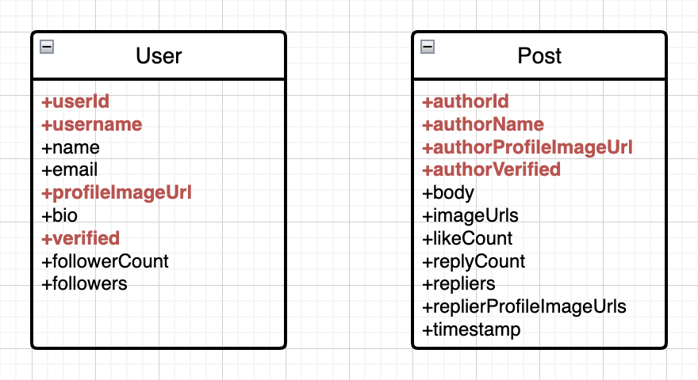

# 개발 일지

## Pomodoro App

### Fade Effect


**[구현 코드](../lib/webtoon_app_challenge/pomodoro_app/widgets/minute/minutes_list_fade_effect.dart)**

- 시간을 설정하는 버튼들 위에 `LinearGradient`를 덮어서 화면 가장자리로 갈수록 흐려지며 사라지는 효과 구현
- Gradient의 center color를 opacity가 0인 배경과 동일한 색상으로 설정해서 자연스러운 fade 효과 구현
- `IgnorePointer` widget을 사용해서 fade 효과를 주는 widget이 user event를 무시하고 아래 widget으로 전달하도록 구현

## Twitter Onboarding

### Text에서 특정 단어에 link 만들기


**[구현 코드](../lib/tiktok_clone_challenge/twitter_onboarding/features/common/widgets/linkable_text.dart)**

> 개념을 확장해서 text의 특정 문자열에 style을 쉽게 할 수 있는 [`customizable_text` package](https://github.com/cskime/customizable_text)를 개발하고 배포했습니다.

- Text에서 특정 단어에 다른 style을 줄 때 `RichText`를 사용함
- `RichText`는 전체 text의 길이와 다른 style을 갖는 단어의 개수가 많아질수록 `RichText`의 `children` 코드가 복잡해지고 변경하기 어려워지는 문제가 있음
- 전체 text와 그 중에서 다른 style을 적용할 text list만 전달해서 다른 style을 적용할 수 있는 `LinkableText` widget 구현
  - 특정 단어들에 다른 style 일괄 적용
  - 특정 단어에 개별적으로 style 적용
  - `TapGestureRecognizer`를 사용하여 링크를 실행시킬 수 있는 callback 제공
- 길고 복잡한 custom text를 쉽고 직관적으로 만들 수 있음
- 사용 예시
  - Before
    ```dart
    // 반복해서 사용되는 TextStyle을 변수로 선언
    final linkTextStyle = TextStyle(
      color: Palette.primary,
      fontWeight: FontWeight.w500,
    );
    Text.rich(
      TextSpan(
        text: 'By signing up, you agree to the ',
        children: [
          TextSpan(text: 'Terms of Service', style: linkTextStyle),
          TextSpan(text: ' and '),
          TextSpan(text: 'Privacy Policy', style: linkTextStyle),
          TextSpan(text: ', including '),
          TextSpan(text: 'Cookie Use', style: linkTextStyle),
          TextSpan(text: '. Twitter may use your contact information, including your email address and phone number for purposes outlined in our Privacy Policy, like keeping your account secure and personalizing our services, including ads. '),
          TextSpan(text: 'Learn more', style: linkTextStyle),
          TextSpan(text: '. Others will be able to find you by email or phone number, when provided, unless you choose otherwise '),
          TextSpan(text: 'here', style: linkTextStyle),
          TextSpan(text: '.'),
        ],
      ),
    ),
    ```
  - After
    ```dart
    final linkTextStyle = TextStyle(
      color: Palette.primary,
      fontWeight: FontWeight.w500,
    );
    LinkableText(
      text: 'By signing up, you agree to the Terms of Service and Privacy Policy, including Cookie Use. Twitter may use your contact information, including your email address and phone number for purposes outlined in our Privacy Policy, like keeping your account secure and personalizing our services, including ads. Learn more. Others will be able to find you by email or phone number, when provided, unless you choose otherwise here.',
      links: [
        Link(text: 'Terms of Service', style: linkTextStyle, callback: () {}),
        Link(text: 'Privacy Policy', style: linkTextStyle, callback: () {}),
        Link(text: 'Cookie Use', style: linkTextStyle, callback: () {}),
        Link(text: 'Learn more', style: linkTextStyle, callback: () {}),
        Link(text: 'here', style: linkTextStyle, callback: () {}),
      ],
    ),
    ```

### TextField Customizing


**[구현 코드](../lib/tiktok_clone_challenge/twitter_onboarding/features/common/widgets/custom_text_field.dart)**

- Flutter의 내장 `TextField`와 `TextFormField`는 UI customizingg에 한계가 있음
- 요구사항
  - Input text에 대한 verification이 통과되었을 때 오른쪽에 checkmark 표시되어야 함
  - 비밀번호 입력 text field의 경우 `obscureText` 설정을 toggle할 수 있는 버튼이 항상 표시되어야 함
- 위 요구사항을 구현할 때 `TextField.suffix` 및 `TextField.suffixIcon` 등을 사용할 수도 있지만, alignment나 padding 등을 커스터마이징 하는데 한계가 있음
  - 항상 표시되어야 하는 obscure toggle 버튼은 `suffixIcon`에, text가 입력되었을 때 표시되어야 하는 checkmark는 `suffix`에 할당할 수 있음
  - `suffix` -> `suffixIcon` 순서로 배치되기 때문에, obscure toggle 버튼을 checkbox 왼쪽에 배치할 수 없음
  - `suffixIcon`은 `TextField`의 전체 크기를 차지하며 오른쪽 끝에 고정되기 때문에, input text와 vertical align을 맞추기 어려움
- 이런 문제를 해결하기 위해 `TextField`를 활용한 `CustomTextField` widget 개발
  - Suffix icon들과 input text의 vertical center alignment 설정
  - 항상 표시되는 obscure toggle button이 text 입력 시에만 표시되는 checkmark icon보다 왼쪽에 위치
  - Label text 및 helper text가 나타나는 조건 설정 (behavior)
    - `CustomTextFieldLabelTextBehavior`
    - `CustomTextFieldHelperTextBehavior`

### VerificationCodeInput


**[구현 코드](../lib/tiktok_clone_challenge/twitter_onboarding/features/verification/widgets/verification_code_input.dart)**

- Code 숫자를 한 자리씩 나뉘어 입력할 수 있는 custom widget 개발
- `GestureDetector`로 tap event를 받으면 보이지 않게 숨겨둔 `TextField`에 연결해 둔 `FocusNode`로 focus를 요청하는 방식으로 숫자 키패드를 띄움
- 숨겨둔 `TextField`에 code를 입력할 때 마다 code text를 한 자리씩 parsing해서 6개의 digit text에 입력

## Thread Clone

### Post widget에서 content 양에 따라 늘어나는 vertical bar 구현


**[구현 코드](../lib/tiktok_clone_challenge/thread_app/features/home/widgets/post_list_item.dart)**

- Post widget에서 profile image와 content들은 각각 `Column`을 사용하고 있음
- Content 길이가 늘어남에 따라 profile image 아래 vertical bar가 남은 영역을 차지할 수 있도록 `Expanded` widget을 사용하려고 하면 "RenderFlex' exception 발생
  <div></div>
- `Column`은 height constraint가 unlimited이기 때문에 `Expanded`와 함께 사용하면 높이가 설정되지 않아서 exception error가 발생한다.
- 이 문제를 해결하기 위해 두 `Column`을 포함하고 있는 `Row`를 `IntrinsicHeight`으로 wrap
- `IntrinsicHeight`은 `Row` 아래에 있는 두 `Column`의 `children` widget들의 layout size를 계산해서 `Row`가 계산된 height을 사용하도록 함
- `IntrinsicHeight`에 의해 content height으로 높이가 고정되었으므로 `Expanded`를 사용해서 available space 전체에 vertical height을 그릴 수 있다.

### Modal bottom sheet를 사용할 때 content가 keyboard에 가리는 문제

**[구현 코드](../lib/tiktok_clone_challenge/thread_app/features/post/new-post/write_screen.dart)**

- `showModalBottomSheet`로 띄우는 widget은 keyboard가 나타나도 content 영역이 자동으로 줄어들지 않음
- Content가 keyboard에 가리지 않도록 content 영역의 크기를 조절해 주어야 함
- 다음과 같이 keyboard가 나타났을 때 content가 나타나는 영역의 크기를 계산하도록 구현
  - `MediaQuery.viewInsetsOf(context).bottom`
    - `MediaQuery.viewInsets`는 screen에서 system UI에 의해 가려지는 inset을 반환
    - 가상 keyboard가 screen을 가리고 있을 때, 이 값의 `bottom`은 keyboard 높이가 된다.
  - `LayoutBuilder`
    - Parent widget의 constraints를 사용해서 child widget을 build 할 수 있음
    - Bottom sheet의 전체 height에서 keyboard height을 제외한 영역에 content가 보여야 함
    - `BoxConstraints.maxHeight - keyboardHeight`으로 content height 계산

### `camera` package의 `CameraPreview` size 조절


**[구현 코드](../lib/tiktok_clone_challenge/thread_app/features/camera/camera_screen.dart)**

- `camera` package에서 camera 화면을 보여주기 위해 `CameraPreview` 사용
- `CameraPreview`는 내부적으로 `previewSize`를 이용해서 `AspectRatio` widget을 사용하여 preview size 비율이 고정됨
- `CameraPreview`를 화면 전체에 보여주려고 하는 경우, screen width가 max width constraint로 사용되므로 `CameraPreview` 크기를 비율에 맞게 키울 수 없다.
- `CameraPreview`가 기존의 size constraint를 벗어날 수 있도록 `OverflowBox`를 사용하고 `maxWidth`와 `maxHeight`을 변경하려는 size로 설정하면 전체 화면에 딱 맞게 크기를 키울 수 있다.
  - [참고한 코드](https://github.com/flutter/flutter/issues/15953#issuecomment-855182376)
  - Screen size와 `CameraPreview`의 내장 `previewSize`를 사용하여 `CameraPreview` height이 screen height일 때 늘어나야 하는 `CameraPreview` width를 계산

### `go_router`의 `push()`로 routing 할 때 url이 바뀌지 않는 문제

- 강의에서 배운 것과 달리 web browser 환경에서 `context.push()`를 사용했을 때 url path가 바뀌지 않음
- 강의에서 사용한 `go_router` package 버전은 v6.0.2인데, 과제에서는 v14.2.0을 사용했음
- Package change log를 살펴보고 `go_router` v8.0 버전 부터 push method가 URL을 갱신하지 않도록 수정된 것을 확인
  > Imperatively pushed GoRoute no longer change URL.<br>
  > Browser backward and forward button respects imperative route operations
- "**Imperatively pushed GoRoute**"란 `context.push()`와 같은 명령형 routing을 의미
- 즉, `go_router` v8.0부터 `context.push~()` 종류의 method를 호출해서 화면을 전환할 때 URL path가 변경되지 않는다.
- `kIsWeb` flag를 사용해서 web 환경일 때만 `GoRouter.optionURLReflectsImperativeAPIs` 값을 `true`로 바꿔주면 이전과 같이 동작한다.
  ```dart
  void main() {
    if (kIsWeb) {
      GoRouter.optionURLReflectsImperativeAPIs = true;
    }
    runApp(const ThreadApp());
  }
  ```
- `optionURLReflectsImperativeAPIs`는 이전 버전과의 호환성을 위한 옵션인데, route stack의 최상위 `GoRoute`가 항상 deeplinking이 가능한 것은 아니기 때문에 `true`로 설정하는 것을 피하라고 강력히 권고한다고 한다.
  > This option is for backward compatibility. It is strongly suggested against setting this value to true, as the URL of the top-most GoRoute is not always deeplink-able.
- `optionURLReflectsImperativeAPIs` 속성은 web에만 영향을 미치므로, mobile과 web을 동시에 개발하면서 deeplink까지 고려한다면 이 속성을 `true`로 설정하지 않을 수 있도록 routing 전략을 다르게 가져가야 할 것 같다.
- 참고
  - [go_router CHANGELOG.md](https://github.com/flutter/packages/blob/main/packages/go_router/CHANGELOG.md#800)
  - [Related GitHub issue](https://github.com/flutter/flutter/issues/129893#issuecomment-1617762284)
  - [optionURLReflectsImperativeAPIs](https://pub.dev/documentation/go_router/latest/go_router/GoRouter/optionURLReflectsImperativeAPIs.html)

### NoSQL data modeling

- Firebaes Firestore는 NoSQL database이므로 일반적인 RDBMS에서와 다르게 modeling을 해야 한다.
- NoSQL database에서 data modeling은 "**화면에 출력할 data를 중심으로**" 한다.
- 이 때, data를 읽어오는 횟수를 최소화하기 위해 의도적으로 data를 중복으로 저장한다.
  <p></p>

## Flashcard App

### Card를 뒤집는 animation 구현 시, 서로 다른 3개의 부분 animation들의 sync 맞추기

- Card를 뒤집을 때 3개의 animation 필요
  1. Y 축 회전 -> Y axis rotation
  2. Text fade out -> Opacity 1 to 0
  3. Card 음영 처리 -> Background color white -> grey -> white
- 1초간 rotation animation이 실행될 때 다른 두 animation은 0.5초 단위로 animatino이 실행되어야 함
  - Card가 절반 회전했을 때 text opacity가 0이 되어야 뒷면이 나타날 때 text가 보이지 않음
  - Card가 절반 회전했을 때 background color가 짙은 회색이고, 뒷면이 나타날수록 흰색이 되어야 card가 회전하는 동안 자연스러운 음영 처리 가능
- 각 animation마다 실행되는 duration이 다르므로 `AnimationController`를 각각 만들고 `AnimatedBuilder`를 중첩해서 구현 가능
  ```dart
  // 0.5초동안 flip
  late final _flipRotationController = AnimationController(
    vsync: this,
    duration: const Duration(milliseconds: 500),
  );

  // 0.25초 동안 white -> grey (forward)
  // 나머지 0.25초 동안 grey -> white (reverse)
  late final _flipColorController = AnimationController(
    vsync: this,
    duration: const Duration(milliseconds: 250),
  );

  // 0.25초 동안 fade out
  late final _flipOpacityController = AnimationController(
    vsync: this,
    duration: const Duration(milliseconds: 250),
  );

  ...

  AnimatedBuilder(
    animation: _flipRotationController, // 1. rotation
    builder: (context, child) {
      // 0 ~ 1 -> 0 ~ pi mapping
      final rotationAngle = Tween<double>(
        begin: 0,
        end: pi,
      ).transform(_flipRotationController.value);

      return AnimatedBuilder(
        animation: _flipColorController, // 2. background color
        builder: (context, child) {
          // 0 ~ 1 -> white -> grey -> white mapping
          final color = ColorTween(
            begin: Colors.white,
            end: Colors.grey.shade800,
          ).transform(_flipColorController.value);

          return AnimatedBuilder(
            animation: _flipOpacityController, // 3. opacity (fade-out)
            builder: (context, child) {
              // 0 ~ 1 ->
              final opacity = Tween<double>(
                begin: 1,
                end: 0,
              ).transform(_flipOpacityController.value)

              ...

              Transform.rotate(
                angle: rotationAngle, // 1. rotation
                child: Flashcard(
                  backgroundColor: color, // 2. background color
                  opacity: opacity, // 3. opacity (fade-out)
                  ...
                ),
              ),
            },
          );
        },
      );
    },
  ),
  ```
- 하지만, 이 방법은 `AnimationController`를 3개나 사용해야 하고 `AnimatedBuilder`가 다수 중첩되어 rebuild 횟수가 많아지면 성능에 문제가 생길 수 있다.
- 따라서, 아래와 같이 `AnimationController` 1개로 3가지 animation에 사용될 값을 계산하도록 개선한다.
  - 필요한 값이 `0 -> 1 -> 0`과 같은 형태를 가지므로 **삼각함수**를 활용하면 쉽게 계산할 수 있다.
  - Opacity
    - 0.25초 동안 opacity가 1에서 0이 되면, 나머지 0.25초는 0을 유지시키면 된다.
    - 즉, `AnimationController` value가 0에서 1로 변할 때 opacity는 `1 -> 0 -> 0`으로 변해야 한다.
    - `cos()` 함수에 0부터 pi까지의 값을 넣으면 1부터 -1까지 값을 얻을 수 있는데, 이 때 최소값을 0으로 제한하면 `1 -> 0 -> 0`으로 변화하는 값을 얻는다.
  - Color
    - 0.25초 동안 `white -> grey`가 되었다가, 나머지 0.25초 동안 `grey -> white`가 되어야 한다.
    - 즉, `0 -> 1 -> 0`의 값 패턴이 필요한데, 이 값은 `sin()` 함수에 0부터 pi까지의 값을 넣으면 얻을 수 있다.
    - `Color.lerp(c1, c2, t)` method를 사용해서 `t`값의 변화에 따라 `Color` 값을 계산한다. 이 함수는 `t`가 0이면 `c1`을, 1이면 `c2`를 반환한다.
- 이렇게 계산한 값을 사용하면 `AnimationController` 1개로 flip에 필요한 3가지 animation을 구현할 수 있다.
  ```dart
  // 0 ~ 1 사이 animation value
  late final _flipController = AnimationController(
    vsync: this,
    duration: const Duration(milliseconds: 500),
  );

  ...

  AnimatedBuilder(
    animation: _flipController, // 1. rotation
    builder: (context, child) {
      // 0 ~ 1 -> 0 ~ pi mapping
      final rotationAngle = _flipController.value * pi;
      final color => Color.lerp(
        Colors.white,
        Colors.grey.shade800,
        sin(_flipController.value * pi),
      );
      final opacity = cos(_flipController.value * pi).clamp(0, 1);

      return Transform.rotate(
        angle: rotationAngle, // 1. rotation
        child: Flashcard(
          backgroundColor: color, // 2. background color
          opacity: opacity, // 3. opacity (fade-out)
          ...
        ),
      );
    },
  ),
  ```
  - 최소값을 제한하기 위해 `min`, `max` 대신 `clamp` method를 사용해서 코드를 단순화한다.
  - 불필요한 `Tween.transform` method는 제거하고 단순 계산식으로 변경한다.